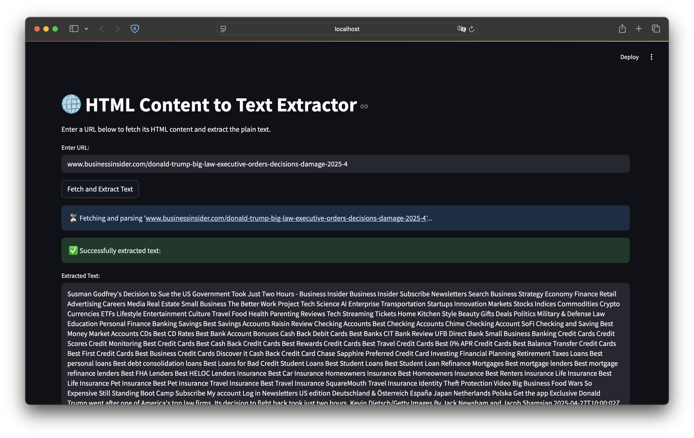

# 🌐 HTML Text Extractor



A simple web application built with Streamlit that allows users to enter a URL, fetch its HTML content, parse it using BeautifulSoup, and extract the plain text, removing script and style elements.

## Features

*   Fetches content from a given URL (attempts HTTPS first, then HTTP if no scheme is provided).
*   Parses the raw HTML source code.
*   Uses BeautifulSoup to extract text content.
*   Removes content from `<script>` and `<style>` tags.
*   Provides a simple web interface for input and output.
*   Displays extracted text or relevant error messages (e.g., connection issues, timeouts, non-HTML content).

## Prerequisites

Before you begin, ensure you have the following installed:

*   **Python:** Version 3.7 or higher recommended.
*   **pip:** Python package installer (usually comes with Python).

## Installation

1.  **Get the Code:** Make sure you have the application script (e.g., `app.py`) saved on your local machine.

2.  **Install Dependencies:** Open your terminal or command prompt, navigate to the directory where you saved the script, and run the following command to install the required Python libraries:

    ```bash
    pip install streamlit requests beautifulsoup4
    ```

## Running the Application

1.  **Navigate:** Open your terminal or command prompt and change to the directory containing the `app.py` file.

2.  **Run Streamlit:** Execute the following command:

    ```bash
    streamlit run streamlit_parser.py
    ```

3.  **Access the App:** Streamlit will start a local web server and should automatically open the application in your default web browser. If it doesn't, the terminal output will provide local and network URLs (usually starting with `http://localhost:8501`) that you can navigate to manually.

## How to Use

1.  Once the application is open in your browser, you will see a title and an input field labeled "Enter URL:".
2.  Type or paste the full URL of the website you want to extract text from (e.g., `www.google.com`, `https://example.com`, `https://en.wikipedia.org/wiki/Python_(programming_language)`).
3.  Click the "Fetch and Extract Text" button.
4.  The application will show a loading indicator while it fetches and parses the URL.
5.  If successful, the extracted plain text content will be displayed in a text area below a success message.
6.  If an error occurs (e.g., invalid URL, network timeout, the site blocks the request, non-HTML content), an error message detailing the issue will be shown instead.

## Limitations

*   **No JavaScript Execution:** This tool parses the initial HTML source code returned by the server. It **does not** execute JavaScript. Content loaded dynamically via JavaScript after the initial page load will likely be missed. For complex, JavaScript-heavy sites, tools like Selenium or Playwright might be necessary.
*   **Website Blocking:** Some websites actively block automated scraping attempts, even with a common `User-Agent` header. This tool may not work on all websites.
*   **Parsing Accuracy:** While BeautifulSoup is robust, complex or malformed HTML might lead to imperfect text extraction. The quality of the output depends heavily on the structure of the source HTML.
*   **Basic Error Handling:** The app handles common connection, timeout, and HTTP errors, but may not cover all edge cases gracefully.